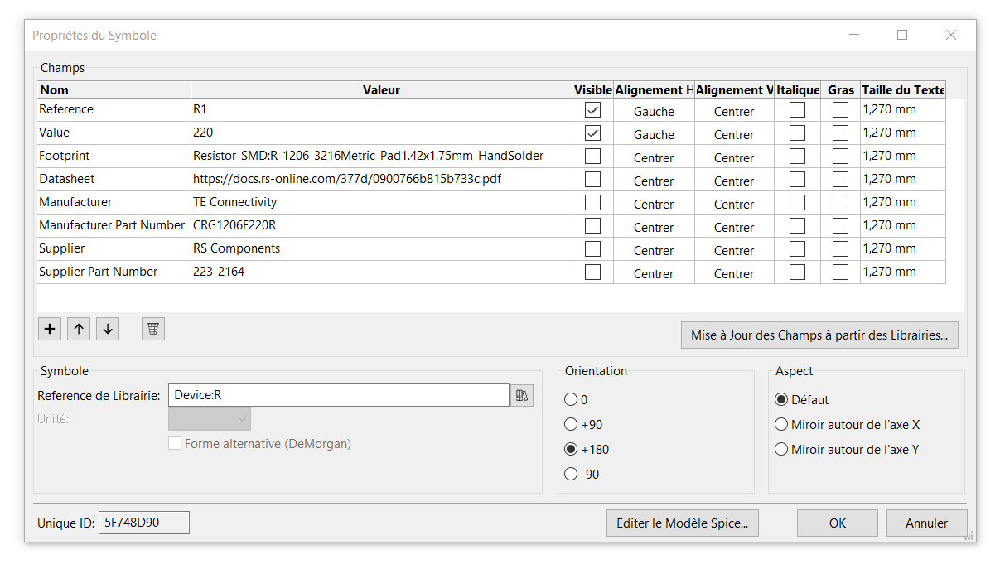

# Project documents

## About the use of KiCad

    Application: KiCad
    Version: (5.1.7)-1, release build
    Libraries:
        wxWidgets 3.0.5
        libcurl/7.71.0 OpenSSL/1.1.1g (Schannel) zlib/1.2.11 brotli/1.0.7 libidn2/2.3.0 libpsl/0.21.0 (+libidn2/2.3.0) libssh2/1.9.0 nghttp2/1.41.0
    Platform: Windows 8 (build 9200), 64-bit edition, 64 bit, Little endian, wxMSW
    Build Info:
        wxWidgets: 3.0.5 (wchar_t,wx containers,compatible with 2.8)
        Boost: 1.73.0
        OpenCASCADE Community Edition: 6.9.1
        Curl: 7.71.0
        Compiler: GCC 10.2.0 with C++ ABI 1014

    Build settings:

        KICAD_SCRIPTING_WXPYTHON=ON
        KICAD_SCRIPTING_WXPYTHON_PHOENIX=OFF
        KICAD_SCRIPTING_ACTION_MENU=ON
        BUILD_GITHUB_PLUGIN=ON
        KICAD_USE_OCE=ON
        KICAD_USE_OCC=OFF
        KICAD_SPICE=ON

### Local library

    .
    └── kicad-project-power-switching-system
        ├── kicad_local_lib
        └── kicad_local_mod
            └── Button_Switch_THT.pretty (Local_Button_Switch_THT)
            └── Connector_Banana.pretty (Local_Connector_Banana)
            └── Connector_BarrelJack.pretty (Local_Connector_BarrelJack)
            └── Layer_ID.pretty
            └── LED_THT.pretty
            └── packages3d
                └── Button_Switch_THT.3dshapes
                └── Connector_Banana.3dshapes
                └── Connector_BarrelJack.3dshapes
                └── LED_THT.3dshapes

### Library management in KiCad version 5

[KiCad Library Convention](https://kicad-pcb.org/libraries/klc/)

### Additional fields in Symbol Properties

---

## About the use of FreeCAD

https://www.freecadweb.org/downloads.php

    OS: Windows 10
    Word size of OS: 64-bit
    Word size of FreeCAD: 64-bit
    Version: 0.18.4 (GitTag)
    Build type: Release
    Branch: releases/FreeCAD-0-18
    Hash: 980bf9060e28555fecd9e3462f68ca74007b70f8
    Python version: 3.6.6
    Qt version: 5.6.2
    Coin version: 4.0.0a
    OCC version: 7.3.0
    Locale: French/France (fr_FR)

---

## Open Source Hardware Association

<!--  -->

https://www.oshwa.org/
