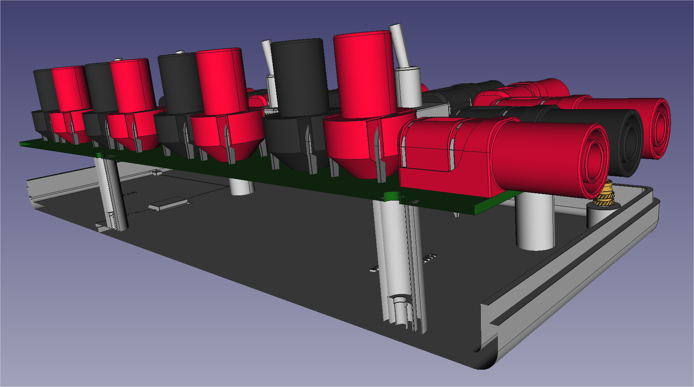
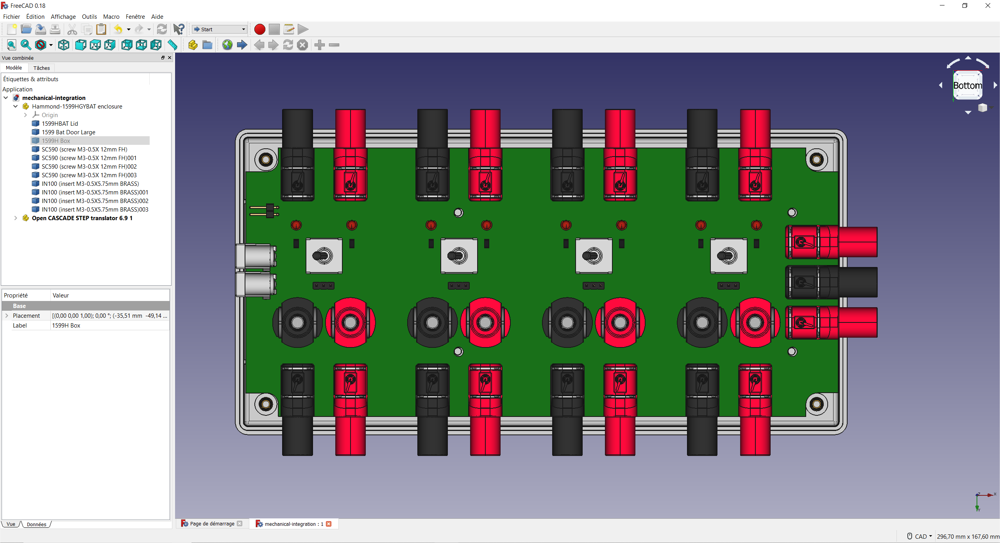
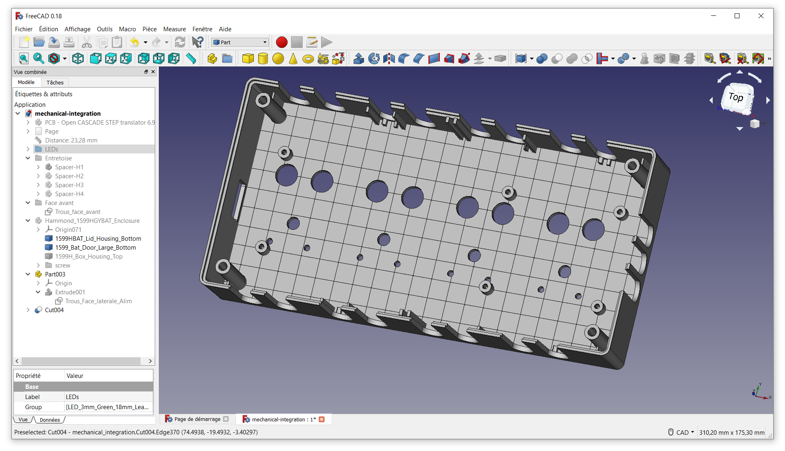

# Boîtier Hammond en ABS, 220 x 110 x 44mm, Gris IP54

Code commande RS [514-1897](https://fr.rs-online.com/web/p/boitiers-pour-usage-general/5141897/)

Référence fabricant [1599HGYBAT](https://www.hammfg.com/part/1599HGYBAT)

Marque Hammond

Fixer les LED entre 16 et **18** mm du haut par rapport au plan Top du PCB.

Prévoir colonnette ou entretoise pour réhausser la carte de :

* 18.52 mm depuis l'extrémité supérieur des colonnettes du boitier, diamètre extérieur 5.5 mm
* 23.28 mm du font du boitier au dessous du PCB (for spacer)

## FreeCAD - 3D parametric modeler

[FreeCAD](https://www.freecadweb.org/?lang=fr), version: 0.18.4

## Visualization of the machining of the housing

