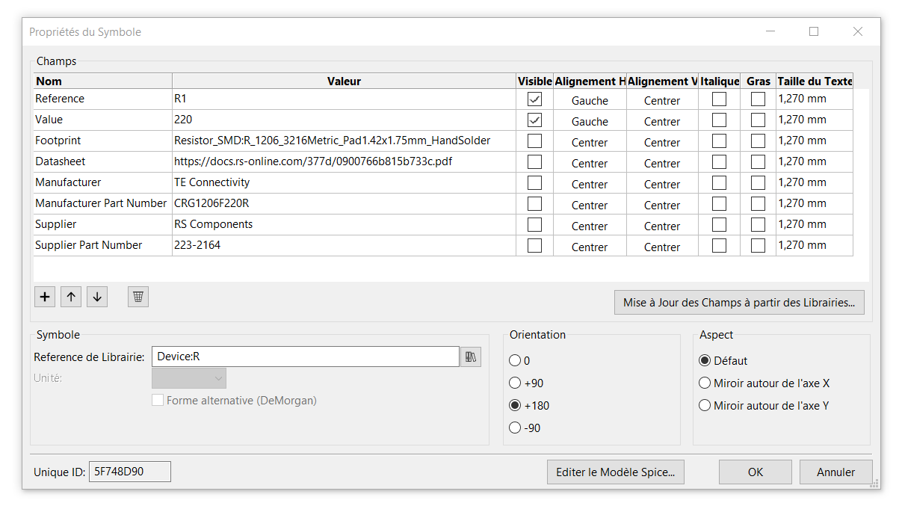

# Power switching system

Realization of a four switch power supply board.

## Feuille de route (check list)

- [x] Analysis of the specifications
- [x] Choice of components and case
- [x] Validation of the schematic
- [x] Definition of the PCB outline from the internal dimensions of the case
- [x] Validate component placement and lock footprints
- [x] Routing validation
- [x] Screen printing validation
- [x] Generating design files
- [ ] Assembly of components on the PCB
- [ ] Integration of the electronic card in the case
- [ ] Device delivery
---

## Electrical diagram

---

## Bill Of Materials (BOM), public prices as of september 2020

 | Description                                                                     | Supplier         | Supplier Part Number                                                            | Quantity | By multiple of    | Unit price | Row value |
 | :------------------------------------------------------------------------------ | :--------------- | :------------------------------------------------------------------------------ | :------: | ----------------- | ---------: | --------: |
 | Boîtier Hammond en ABS, 220 x 110 x 44mm, Gris IP54                             | RS Components    | [514-1897](https://fr.rs-online.com/web/p/boitiers-pour-usage-general/5141897/) |    1     | unit              |    12,16 € |   12,16 € |
 | Alimentation enfichable 5V c.c., 1A, 5W                                         | RS Components    | [121-7115](https://fr.rs-online.com/web/p/adaptateurs-ac-dc/1217115/)           |    1     | unit              |     6,67 € |    6,67 € |
 | Connecteur Jack RS PRO Double c.c. Femelle 2,1 mm, 2,5 mm, Montage sur CI       | RS Components    | [805-1699](https://fr.rs-online.com/web/p/fiches-et-prises-jack/8051699/)       |    2     | in multiples of 5 |    1,282 € |    6,41 € |
 | Alimentation enfichable 5V c.c., 1A, 5W                                         | RS Components    | [121-7115](https://fr.rs-online.com/web/p/adaptateurs-ac-dc/1217115/)           |    1     | unit              |    6,003 € |    6,00 € |
 | LED Rouge, Traversant, 3 mm (T-1), 2 V                                          | RS Components    | [228-5916](https://fr.rs-online.com/web/p/led/2285916/)                         |    4     | in multiples of 5 |    0,126 € |    0,63 € |
 | LED Vert, Traversant, 3 mm (T-1), 2,2 V                                         | RS Components    | [228-5944](https://fr.rs-online.com/web/p/led/2285944/)                         |    4     | in multiples of 5 |    0,126 € |    0,63 € |
 | Fiche banane Staubli Noir Femelle 24A 1 kV, 600 V (vertical)                    | RS Components    | [122-9670](https://fr.rs-online.com/web/p/fiches-bananes/1229670/)              |    4     | unit              |    6,138 € |  24,552 € |
 | Fiche banane Staubli Rouge Femelle 24A 1 kV, 600 V (vertical)                   | RS Components    | [122-9671](https://fr.rs-online.com/web/p/fiches-bananes/1229671/)              |    4     | unit              |    6,138 € |  24,552 € |
 | Fiche banane Schutzinger Noir Embase 24A 1kV (horizontal)                       | RS Components    | [144-1451](https://fr.rs-online.com/web/p/fiches-bananes/1441451/)              |    9     | unit              |    5,238 € |  47,142 € |
 | Fiche banane Schutzinger Rouge Embase 24A 1kV (horizontal)                      | RS Components    | [144-1450](https://fr.rs-online.com/web/p/fiches-bananes/1441450/)              |    10    | unit              |    5,238 € |    52,4 € |
 | Interrupteur à levier RS PRO, On-Off-On, 2RT, 5 A @ 28 V c.c.                   | RS Components    | [401-692](https://fr.rs-online.com/web/p/interrupteurs-a-levier/0401692/)       |    4     | unit              |    2,484 € |   9,936 € |
 | _______________________________________________________________________________ | ________________ | _______________________                                                         | ________ | _________________ | __________ | _________ |
 |                                                                                 |                  |                                                                                 |          |                   |      TOTAL |  191,08 € |

---

## Integration into the housing

[Hammond 1599HGYBAT](https://www.hammfg.com/part/1599HGYBAT)

Enclosure - plastic, size: 220 mm x 110 mm x 44 mm (L x W x H)

PCB outline, size: 213,00 mm x 96,60 mm (L x W)

## Component placement

## 3D rendering

## Integration of the electronic card in the case with the [FreeCAD](https://www.freecadweb.org) software

## Sectional view

---

## KiCad

[KiCad EDA - Schematic Capture & PCB Design Software](https://kicad-pcb.org/)

Open source EDA / electronics CAD software for Windows, macOS and Linux.

Use schematic capture, design PCB layouts and view them in 3D, all forever free.

#### Library management in KiCad version 5

[KiCad Library Convention](https://kicad-pcb.org/libraries/klc/)

### Additional fields in Symbol Properties

## Open Source Hardware Association

https://www.oshwa.org/
