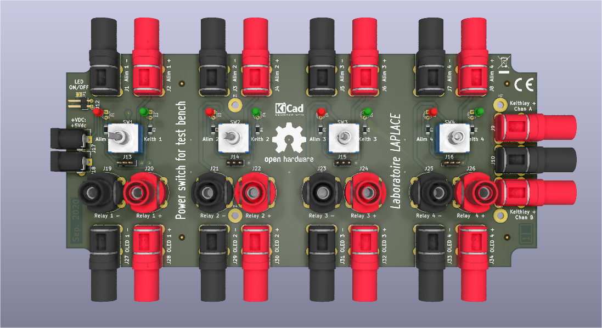

# kicad project power switching system

Power switching system

[Fr] Carte 4 interrupteurs de commutation d'alimentation

[Fr] Réalisation d'une carte "Carte switch Alim" v0.1.0

## Feuille de route (check list)

- [x] Analyse du cahier des charges
- [x] Choix des composants et du boitier
- [x] Validation de la schématique
- [x] Définition du contour du PCB à partir des dimensions internes du boitier
- [x] Validation du placement des composants et vérouillage des empreintes
- [ ] Validation du routage
- [ ] Validation de la sérigraphie

---

### Bill Of Materials (BOM), public prices as of september 2020

| No article                                                                      | Quantité | Description                                                               | A l'unité                   | Prix à l'unité | Valeur de la ligne |
| ------------------------------------------------------------------------------- | -------- | ------------------------------------------------------------------------- | --------------------------- | -------------- | ------------------ |
| [514-1897](https://fr.rs-online.com/web/p/boitiers-pour-usage-general/5141897/) | 1        | Boîtier Hammond en ABS, 220 x 110 x 44mm, Gris IP54                       | la pièce                    | 12,16 €        | 12,16 €            |
| [121-7115](https://fr.rs-online.com/web/p/adaptateurs-ac-dc/1217115/)           | 1        | Alimentation enfichable 5V c.c., 1A, 5W                                   | la pièce                    | 6,67 €         | 6,67 €             |
| [805-1699](https://fr.rs-online.com/web/p/fiches-et-prises-jack/8051699/)       | 2        | Connecteur Jack RS PRO Double c.c. Femelle 2,1 mm, 2,5 mm, Montage sur CI | l'unité (par multiple de 5) | 1,282 €        | 6,41 €             |
| [121-7115](https://fr.rs-online.com/web/p/adaptateurs-ac-dc/1217115/)           | 1        | Alimentation enfichable 5V c.c., 1A, 5W                                   | la pièce                    | 6,003 €        | 6,00 €             |
| [228-5916](https://fr.rs-online.com/web/p/led/2285916/)                         | 4        | LED Rouge, Traversant, 3 mm (T-1), 2 V                                    | l'unité (par multiple de 5) | 0,126 €        | 0,63 €             |
| [228-5944](https://fr.rs-online.com/web/p/led/2285944/)                         | 4        | LED Vert, Traversant, 3 mm (T-1), 2,2 V                                   | l'unité (par multiple de 5) | 0,126 €        | 0,63 €             |
| [122-9670](https://fr.rs-online.com/web/p/fiches-bananes/1229670/)              | 4        | Fiche banane Staubli Noir Femelle 24A 1 kV, 600 V (vertical)              | la pièce                    | 6,138 €        | 24,552 €           |
| [122-9671](https://fr.rs-online.com/web/p/fiches-bananes/1229671/)              | 4        | Fiche banane Staubli Rouge Femelle 24A 1 kV, 600 V (vertical)             | la pièce                    | 6,138 €        | 24,552 €           |
| [144-1451](https://fr.rs-online.com/web/p/fiches-bananes/1441451/)              | 9        | Fiche banane Schutzinger Noir Embase 24A 1kV (horizontal)                 | la pièce                    | 5,238 €        | 47,142 €           |
| [144-1450](https://fr.rs-online.com/web/p/fiches-bananes/1441450/)              | 10       | Fiche banane Schutzinger Rouge Embase 24A 1kV (horizontal)                | la pièce                    | 5,238 €        | 52,4 €             |
| [401-692](https://fr.rs-online.com/web/p/interrupteurs-a-levier/0401692/)       | 4        | Interrupteur à levier RS PRO, On-Off-On, 2RT, 5 A @ 28 V c.c.             | la pièce                    | 2,484 €        | 9,936 €            |

---

### [Fr] Intégration dans le boîtier - Integration into the housing

[Hammond 1599HGYBAT](https://www.hammfg.com/part/1599HGYBAT)

Enclosure - plastic, size: 220 mm x 110 mm x 44 mm (L x W x H)

PCB outline, size: 213,00 mm x 96,60 mm (L x W)

### Component placement

3D rendering

---

### KiCad

[KiCad EDA - Schematic Capture & PCB Design Software](https://kicad-pcb.org/)

Open source EDA / electronics CAD software for Windows, macOS and Linux.

Use schematic capture, design PCB layouts and view them in 3D, all forever free.

#### Library management in KiCad version 5

[KiCad Library Convention](https://kicad-pcb.org/libraries/klc/)

#### [Fr] Champs suplémentaires dans les Propriétés du Symbole

#### Open Source Hardware Association

https://www.oshwa.org/
