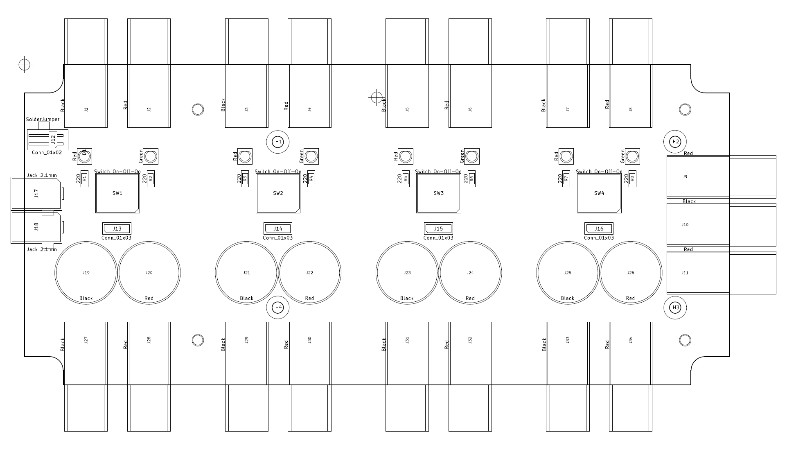
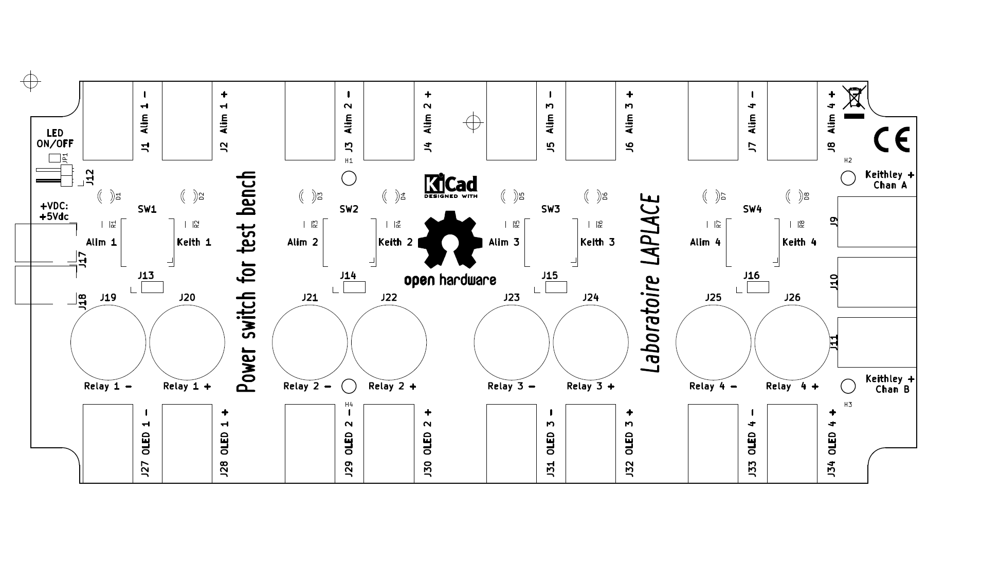

# Power switching system

Realization of a power supply board with four switches for switching between several power sources.

## Check list

- [x] Analysis of the specifications
- [x] Choice of components and case
- [x] Order components
- [x] Validation of the schematic
- [x] Definition of the PCB outline from the internal dimensions of the case
- [x] Validate component placement and lock footprints
- [x] Routing validation
- [x] Screen printing validation
- [x] Generating design files
- [x] Assembly of components on the PCB
- [x] Functional test of the electronic board and validation of the specifications
- [x] Integration of the electronic card in the case
- [x] Final test and document review
- [ ] Device delivery

---

## Tools used

### KiCad

[KiCad EDA - Schematic Capture & PCB Design Software](https://kicad-pcb.org/), version: 5.1.7

Open source EDA / electronics CAD software for Windows, macOS and Linux.

### FreeCAD - 3D parametric modeler

[FreeCAD](https://www.freecadweb.org/?lang=fr), version: 0.18.4

## Electrical diagram

---

## Integration into the housing

[Hammond 1599HGYBAT](https://www.hammfg.com/part/1599HGYBAT)

Enclosure - plastic, size: 220 mm x 110 mm x 44 mm (L x W x H)

## PCB outline, size: 213,00 mm x 96,60 mm (L x W), from FreeCAD

## Component placement and silk screen

|                        Placement                         |                      Silk screen                      |
| :------------------------------------------------------: | :---------------------------------------------------: |
|  |  |
|           F.Mask + Edge.Cuts + F.CrtYd + F.Fab           |                  F.SilkS + Edge.Cuts                  |

|                      Placement and Silk screen                      |
| :-----------------------------------------------------------------: |
|  |
|           F.SilkS + F.Mask + Edge.Cuts + F.CrtYd + F.Fab            |

<!--
### Component placement - Component layout

F.Mask + Edge.Cuts + F.CrtYd + F.Fab

### Silk screen

F.SilkS + Edge.Cuts
-->

## Top - Front Copper layer

<!--  -->

## Bottom - Back Copper layer

<!--  -->

<!-- ## Component layout

pcb-component-placement.pdf
 -->

## 3D rendering

## Integration of the electronic card in the case with the [FreeCAD](https://www.freecadweb.org) software

## Sectional view

## View of final STEP file for CNC

---

## [CHANGELOG](CHANGELOG.md)
